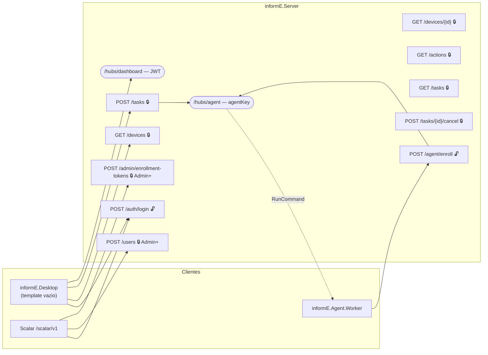
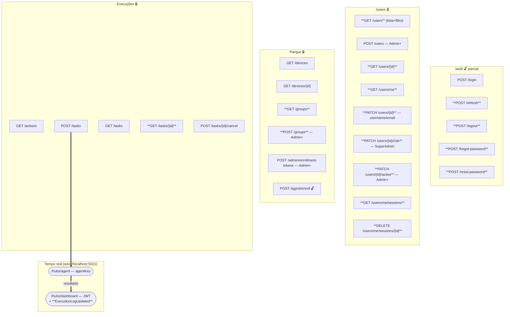

# Revisão completa do servidor informE

> **Este documento vive no repositório** em `docs/plano-revisao-servidor.md`,
> no padrão de `docs/plano-4-semanas.md`. Os diagramas Mermaid renderizam
> direto no GitHub.

## Status — 28/08/2026

Todas as fases entregues. Validado com Server + Postgres + 3 agentes rodando.

| Fase | Estado |
|---|---|
| 0 — Ambiente (banco fora do git, porta única 5021, HTTPS/WSS, validação que lança) | ✅ |
| 1 — Auth completa + CRUD de usuários (5 use cases órfãos ligados + refresh novo) | ✅ |
| 2 — Scalar com `Produces`/`ProducesProblem`/descrições em todos os endpoints | ✅ |
| 3 — `/groups`, seed em dois conjuntos, `POST /admin/seed`, re-enroll por MAC | ✅ |
| 4 — Final boss: despacho paralelo, offline não trava, evento por máquina | ✅ |
| 5 — Pontes para o front-end (DTOs, CORS, `ExecutionLogUpdated`, doc do hub) | ✅ |
| 6 — 160 testes verdes (eram 119), docs realinhados | ✅ |

**Endpoints: 10 → 26** (contando `POST /admin/seed`, que só existe em Development)**.** **Testes: 119 → 160.**

### Números medidos (não estimados)

| Medida | Valor |
|---|---|
| `POST /tasks` (3 máquinas, servidor quente) | 46–61 ms |
| `POST /tasks` (grupo de 21 máquinas) | 555 ms |
| `GET /devices` (109 máquinas) | 94 ms |
| `GET /tasks` (limite 50) | 132 ms |
| Execução fim a fim, **1** máquina | 588 ms |
| Execução fim a fim, **3** máquinas simultâneas | 3,70 s (soma seria 10,4 s) |

> A degradação de 588 ms para ~3,4 s por máquina **não é do servidor**: são 3
> `powershell.exe` + 3 agentes .NET + o Server + o Postgres disputando os núcleos
> de um notebook só. O custo real por comando é ~590 ms — ~520 ms de boot do
> `powershell.exe` e ~1,3 s de `Get-CimInstance` na primeira chamada (depois o SO
> cacheia). Em N máquinas de verdade, o total fica em ~600 ms independente de N.

### Bugs achados durante a execução, além do que o plano previa

| O quê | Onde |
|---|---|
| `devices.status` continuava `Online` depois de todo restart do Server — o registry de conexões é em memória e nasce vazio, mas o banco não sabia disso. A tela mostrava máquinas fantasma por até 90 min | `DatabaseBootstrapper.ResetarConexoesAsync` |
| `RecordCommandResultUseCase` carregava a tarefa inteira + todos os logs + todos os devices **a cada resultado** — 21 cargas completas numa execução de 21 máquinas | `IMachineTaskRepository.HasPendingLogsAsync` |
| `start-db.ps1` morria quando o Docker estava fechado: `docker info 2>$null` dentro de `if` vira `NativeCommandError` no PS 5.1 e o `$ErrorActionPreference='Stop'` abortava — justamente o caso para o qual o script existe | `Test-DockerNoAr` |
| O binder de configuração do .NET **acrescenta** a arrays com valor no inicializador em vez de substituir: a lista de domínios saía duplicada na mensagem de erro mostrada ao usuário | `AuthOptions.PadraoInstitucional` |
| `InvalidRefreshTokenException` sem mapeamento → 500 em vez de 401 | `ExcecaoParaHttpHandler` |
| `setup-dev.ps1` morria no último passo se `dotnet-ef` não estivesse instalado — e nenhum passo dele instalava | removido (redundante com o boot) |

---


## Context

O `informE` é um RMM on-premise (TCC). O backend está numa situação incomum: a
**Application está mais completa que a API**. Existem 13 use cases implementados
e testados (50 testes verdes), 11 repositórios, 14 entidades, 7 migrations, dois
hubs SignalR funcionando — mas **só 10 rotas HTTP** foram mapeadas. Cinco use
cases prontos não têm porta de entrada nenhuma.

O resultado prático: quem abre o Scalar não consegue fazer o CRUD de usuários,
não consegue renovar o token (sessão morre em 15 min), não consegue listar
grupos (mas `POST /tasks` exige `groupIds`), e não vê a maior parte dos schemas
de resposta porque nenhum endpoint declara `.Produces<T>()`.

Além disso o ambiente de desenvolvimento está entupido: o data dir do Postgres
(48 MB, 1341 arquivos binários) está versionado no git, e a porta do Server é
descrita como 5000, 5021 e 7257 em quatro documentos diferentes.

**Objetivo (DoD do usuário):** todas as portas básicas bem orquestradas no
Scalar ⇒ CRUD de usuários completo, mapeamento de máquinas, seeding direto, WSS
real, e só e-mails institucionais. **Final boss:** rodar comandos em simultâneo
em máquinas distintas pelo informE.

### Decisões travadas nesta conversa

| # | Decisão |
|---|---|
| 1 | Domínio de e-mail = **lista configurável**, default `["cps.sp.gov.br","etec.sp.gov.br"]`. Seed e scripts continuam funcionando; produção restringe a `cps`. |
| 2 | Banco volta ao **volume nomeado** `informe_pgdata`; `database/` sai do git. Portabilidade vem de migrate+seed, que já são automáticos. |
| 3 | Porta única de dev = **`https://localhost:5021`**, hubs em `wss://`. 5000 e 7257 saem de circulação. |
| 4 | Final boss validado com **N agentes locais + 1 máquina real** na LAN. |

---

## Diagrama de endpoints

### Antes desta revisão (10 rotas + 2 hubs)



### Hoje, depois desta revisão (em **negrito**, o que entrou)



🔓 anônimo · 🔒 exige JWT

---

## Fase 0 — Desentupir o ambiente

Nada abaixo funciona confortavelmente enquanto o ambiente estiver ambíguo.
Esta fase é pré-requisito das outras.

### 0.0 Versionar este plano

Copiar este documento para `docs/plano-revisao-servidor.md` e linká-lo no
`README.md` ao lado dos outros docs. Primeira coisa a entrar — assim o resto
das mudanças tem para onde apontar na descrição de PR.

### 0.1 Tirar o Postgres do git

- `docker-compose.yml`: reativar `informe_pgdata:/var/lib/postgresql/data`,
  remover o bind-mount `./database`.
- `git rm -r --cached database` e adicionar `database/` ao `.gitignore`.
  (O diretório físico continua no disco de quem já tem; só deixa de ser
  rastreado.)
- Portabilidade fica garantida por `start-db.ps1` + `dotnet run`, que já
  migram e semeiam — ver `DatabaseBootstrapper.cs`.

> Os comentários em `Program.cs:37-39` e `DatabaseBootstrapper.cs:9-12` já
> descrevem o volume nomeado. O compose é que divergiu — isto realinha o código
> com a própria documentação dele.

### 0.2 Porta única: `https://localhost:5021`

- `Properties/launchSettings.json`: um perfil só, `applicationUrl:
  "https://localhost:5021"`, `launchUrl: "scalar/v1"`.
- CORS em `Program.cs:28-32`: trocar a lista por `https://localhost:5021`.
  Remover `localhost:5173` (sobra de Vite — não há Vite no projeto).
- `src/Agent/informE.Agent.Worker/appsettings.json`: `ServerUrl` →
  `https://localhost:5021`.
- `enroll-agent.ps1`: default de `-ServerUrl` → `https://localhost:5021`.
- Adicionar `app.UseHttpsRedirection()`.

### 0.3 WSS de verdade

Com o Server em HTTPS, o SignalR negocia `wss://` sozinho — não há código de
transporte a mudar. O que precisa:

- `dotnet dev-certs https --trust` documentado como passo do setup
  (`setup-dev.ps1` e `docs/ambiente-banco.md`).
- **Ponto de atenção real:** o agente usa `HttpClient` (enroll) e
  `HubConnectionBuilder` (hub). Em máquina que não confia no dev-cert, os dois
  falham. Para o teste em LAN, adicionar em `AgentOptions` um
  `AceitarCertificadoNaoConfiavel` (default `false`), aplicado via
  `HttpMessageHandlerFactory` no `WithUrl` e no `HttpClient`.
  `// ponytail: bypass só pra dev/LAN; em produção o cert da escola é instalado
  na máquina e a flag some.`

### 0.4 Corrigir a validação silenciosa (bug — habilita a Fase 1)

`User.ValidateEmail` e `User.UpdateEmail` (`src/Host/informE.Domain/Entities/User.cs:75-90`)
retornam `bool` em vez de lançar, e o chamador é `if (ValidateEmail(email)) Email = email;`.
E-mail inválido ⇒ `Email = string.Empty`, silenciosamente. Como `users.email` é
único e obrigatório: o **primeiro** usuário ruim é criado sem e-mail e nunca
loga; o **segundo** estoura 23505 → 500.

`CreateUserUseCase.cs:37` até comenta *"O construtor de User valida
username/email/role e lança se inválido"* — não lança.

- Fazer `ValidateEmail` lançar `ArgumentException`, no mesmo formato de
  `ValidateUsername` (que já lança).
- Mesmo padrão em `Device.ValidateHostname/ValidateIpAddress/ValidateMacAddress`
  (`Entities/Device.cs:64-83`) — `hostname` e `mac_address` também são únicos,
  então o bug é idêntico no enroll.

---

## Fase 1 — Auth completa + CRUD de usuários

O núcleo do DoD. Cinco use cases prontos ganham porta de entrada.

### 1.1 Regra de domínio de e-mail

Novo `AuthOptions` em `Infrastructure/Security/` (ao lado de `JwtOptions`):

```csharp
public class AuthOptions
{
    public const string SectionName = "Auth";
    public string[] DominiosPermitidos { get; set; } = ["cps.sp.gov.br", "etec.sp.gov.br"];
}
```

A checagem entra em `CreateUserUseCase` e no novo endpoint de troca de e-mail —
**na Application, não no Domain**: o Domain não lê configuração, e a lista muda
por instalação. O Domain continua validando só o formato (Fase 0.4).

Config em `appsettings.json`; `appsettings.Production` restringe a `cps`.

### 1.2 Endpoints de autenticação — `AuthEndpoints.cs`

| Rota | Origem | Observação |
|---|---|---|
| `POST /auth/refresh` | **use case novo** | A lacuna mais visível hoje. `Session.RefreshTokenHash` já é gravado por `LoginUseCase`; falta um `RefreshTokenUseCase` que valide (Argon2 verify), rotacione o refresh e emita access novo. |
| `POST /auth/logout` | `RevokeSessionUseCase` (existe, 0 chamadas) | Revoga a sessão do `sid`. |
| `POST /auth/forgot-password` | `RequestPasswordResetUseCase` (existe, 0 chamadas) | Resposta sempre 204, exista a conta ou não — anti-enumeração (`politica-login-sessao.md §1`). |
| `POST /auth/reset-password` | `ResetPasswordUseCase` (existe, 0 chamadas) | Token `{Id}.{segredo}`, 1h, uso único. |

> `RefreshTokenUseCase` é o único código de negócio novo desta fase — o resto é
> ligação. Precisa do claim `sid` no JWT (`JwtTokenService`), que a política já
> previa e ainda não existe.

### 1.3 Endpoints de usuário — `UserEndpoints.cs`

| Rota | Papel | Origem |
|---|---|---|
| `GET /users` | Admin+ | **Precisa de `IUserRepository.ListAsync`** (não existe hoje) — filtro por papel/status/busca, no molde de `IDeviceRepository.ListAsync`. |
| `GET /users/{id}` | Admin+ | `GetByIdAsync` já existe. |
| `GET /users/me` | qualquer | Lê do próprio `ClaimsPrincipal` + `GetByIdAsync`. Tela "Meu Perfil". |
| `POST /users` | Admin+ | já existe |
| `PATCH /users/{id}` | Admin+ / próprio | `User.UpdateUsername` / `UpdateEmail` já existem. |
| `PATCH /users/{id}/role` | SuperAdmin | `ChangeUserRoleUseCase` (existe, 0 chamadas) |
| `PATCH /users/{id}/active` | Admin+ | `SetUserActiveUseCase` (existe, 0 chamadas) |
| `GET /users/me/sessions` | qualquer | `GetActiveSessionsAsync` já existe. Coluna "informações de acesso" (IP + último login) do Figma #241. |
| `DELETE /users/me/sessions/{id}` | dono ou Admin+ | `RevokeSessionUseCase`. Destrava quem ficou preso no limite de 3 dispositivos (#242). |

**Sem `DELETE /users/{id}`** — a tela de Administração de Contas tem coluna
Ativo/Inativo, não exclusão, e apagar usuário quebraria as FKs de `AuditLog` e
`MachineTask.CreatedByUserId`. Desativar é a exclusão do produto.
`// ponytail: soft delete é o delete aqui.`

DTOs novos vão todos em `src/Shared/informE.Contracts/Dtos/Api/ApiDtos.cs`,
seguindo os records de leitura já existentes.

---

## Fase 2 — Scalar bem orquestrado

O DoD fala em "portas bem orquestradas no Scalar". A infraestrutura está certa
(`OpenApiBearerAuth.cs` faz o botão Authorize funcionar corretamente); falta
metadata.

Hoje um `grep` por `Produces|ProducesProblem|WithDescription` em `src/` retorna
**zero**. Consequência: `POST /users`, `POST /tasks`, `GET /devices/{id}` e
`POST /tasks/{id}/cancel` retornam `IResult` e aparecem no Scalar **sem schema
de resposta nenhum**.

Para cada endpoint:

- `.Produces<T>(200)` (ou `.Produces(204)`) explícito.
- `.ProducesProblem(400/401/403/404/409)` conforme o mapa de
  `ExcecaoParaHttpHandler.cs` — hoje todo erro é `ProblemDetails` e nenhum está
  documentado.
- `.WithSummary` em todos (falta em `GET /devices/{id}`) e `.WithDescription`
  onde a regra não é óbvia (ex.: o resumo de `/devices` é sobre os itens
  *filtrados*).
- Padronizar em `MapGroup`: `/actions` e `/agent/enroll` e
  `/admin/enrollment-tokens` estão soltos no `app` raiz com `.WithTags`
  individual, fora do padrão dos outros quatro grupos.

Ordem das tags no documento: Autenticação → Usuários → Grupos → Equipamentos →
Execuções → Agente.

---

## Fase 3 — Mapear máquinas e seeding direto

### 3.1 `/groups` — hoje é um beco sem saída

`DispatchTaskRequestDto.GroupIds` exige que o cliente conheça os Ids dos grupos,
e **não existe nenhuma rota que os liste**. `IGroupRepository.ListAsync` já
existe — o endpoint é praticamente de graça.

- `GET /groups` → id, nome, descrição, contagem de devices.
- `POST /groups` (Admin+) → `IGroupRepository.AddAsync` já existe.
- `GET /devices?grupoId=` já funciona para o detalhe de grupo.

### 3.2 Consertar o seed

`DatabaseBootstrapper.SeedDevelopmentDataAsync` aborta com
`if (await db.Users.AnyAsync(ct)) return;`. Isso significa: **criou um usuário
pelo Scalar antes do primeiro seed ⇒ as 105 máquinas nunca são semeadas**, e a
mensagem de log diz apenas "Banco já tem dados — seed ignorado".

- Trocar o guard por verificação **por conjunto** (`if (!db.Devices.Any())`
  semeia devices, `if (!db.Groups.Any())` semeia grupos, etc.), mantendo a
  idempotência que o doc promete.
- Expor `POST /admin/seed` (SuperAdmin, **só em Development**) para re-semear
  sem derrubar o container. É o "seeding direto" do DoD.

### 3.3 Re-enroll de máquina

`EnrollDeviceUseCase` não deduplica por hostname/MAC. Reinstalar o agente numa
máquina já registrada (ou apagar `%LOCALAPPDATA%\informE\`) gera INSERT
duplicado → viola o índice único → 500. Como o teste do final boss envolve
justamente subir e derrubar agentes, isso vai acontecer.

- Se já existe `Device` com o mesmo MAC: rotacionar a chave e devolver o
  `DeviceId` existente, em vez de inserir.

### 3.4 `ExpiresAt` do token de registro

`AgentEndpoints.cs:52` devolve `DateTimeOffset.UtcNow.AddHours(2)` hardcoded,
duplicando a constante que já vive em `EnrollmentToken.cs:20`. Ler da entidade
criada — se a validade mudar, a resposta acompanha.

---

## Fase 4 — Final boss: comandos simultâneos em máquinas distintas

Aqui estão os defeitos que impedem o objetivo. Todos no caminho
`POST /tasks` → `DispatchTaskUseCase` → `SignalRCommandDispatcher` → `AgentHub`.

### 4.1 Uma máquina que falha aborta as outras 🔴

`DispatchTaskUseCase.cs:66-70`:

```csharp
foreach (var log in logs)
{
    var command = new CommandDto(task.Id, log.Id, task.SourceScript, task.Kind.ToString());
    await commandDispatcher.DispatchAsync(log.DeviceId, command, ct);   // exceção aqui mata o resto
}
```

O comentário logo acima ainda diz *"`ICommandDispatcher` ainda não tem
implementação real"* — tem, desde a PR do server. Disparar em 20 máquinas e ter
a nº 3 com conexão morta deixa 17 sem comando.

- `try/catch` por device, marcando aquele log como `Failed` com o motivo, e
  seguindo o loop.
- Trocar o `foreach` sequencial por `Task.WhenAll` — são N envios SignalR
  independentes. É o que torna "simultâneo" verdade e não sequência rápida.

### 4.2 Máquina offline trava a tarefa para sempre 🔴

`SignalRCommandDispatcher.cs:20-26` retorna `Task.CompletedTask` quando o device
está offline, e o log fica `Pending`. Mas `RecordCommandResultUseCase.cs:29`:

```csharp
var stillPending = task.ExecutionLogs.Any(l => l.Status is TaskStatus.Pending or TaskStatus.Running);
if (stillPending) return new RecordCommandResultResponse(TaskCompleted: false, TaskSucceeded: null);
```

Um único alvo offline ⇒ `stillPending` é sempre `true` ⇒ `task.Finish()` nunca
roda ⇒ a tarefa fica `Running` eternamente e nunca aparece concluída na tela.
Num parque de 105 máquinas com 7 offline no seed, **toda tarefa em grupo cai
nisso**.

- `DispatchAsync` passa a devolver `bool` (despachado ou não).
- Device offline ⇒ log nasce `Failed` com output "Máquina offline no momento do
  disparo", e a tarefa fecha normalmente.
  `// ponytail: reentrega na reconexão (RF10) fica pra depois; falhar explícito
  é melhor que travar em silêncio.`

### 4.3 A tela não vê progresso por máquina

`IDashboardClient.TaskProgress(taskId, status)` só dispara quando a tarefa
**inteira** termina (`RecordCommandResultUseCase.cs:37`). Com 20 máquinas, o
operador olha uma tela parada por minutos e depois tudo muda de uma vez — que é
exatamente o oposto do que "executar em simultâneo" deveria mostrar.

- Adicionar a `IDashboardClient`:
  `Task ExecutionLogUpdated(Guid logId, Guid taskId, string status, int? durationMs, string? output);`
- `RecordCommandResultUseCase` emite por log, **antes** da checagem de
  `stillPending`.
- `SignalRDashboardNotifier` ganha o método correspondente.

### 4.4 Rodar N agentes na mesma máquina (harness de teste)

`AgentOptions.IdentityFileName` já é configurável — cada instância pode ter a
sua identidade. Falta só a conveniência:

- `run-agents.ps1 -Count 3`: para cada índice, chama o fluxo de
  `enroll-agent.ps1` (que já automatiza login → token → gravação) e sobe o
  Worker com `Agent__IdentityFileName=informe-agent-N.identity` e
  `Agent__EnrollmentToken` próprio, via variável de ambiente — sem tocar no
  `appsettings.json` compartilhado.
- Cada instância se registra como um `Device` distinto (hostname precisa
  variar: `Agent__HostnameOverride`, opcional, default `Environment.MachineName`).

> Salvar `.ps1` como **UTF-8 com BOM** — `docs/agente.md` documenta que o
> PowerShell 5.1 corrompe acentos sem BOM e quebra o header `Authorization`
> silenciosamente. `start-db.ps1` e `setup-dev.ps1` hoje estão sem BOM.

---

## Fase 5 — Pontes para o front-end

`informE.UI` é o template default (`Component1.razor`) e `informE.Desktop` tem
só `Counter`/`Weather`/`Home`. Nenhuma das 8 telas existe. A ponte, portanto,
**não é código de tela** — é garantir que tudo que as telas precisam já esteja
acessível e tipado quando Eduardo e Bruna começarem.

**Sem SDK cliente, sem wrapper de HttpClient.** Os DTOs já moram em
`informE.Contracts`, que `informE.UI` já referencia — Blazor consome com
`GetFromJsonAsync<DeviceListResponseDto>` direto. Criar uma camada de client
agora seria abstração especulativa.
`// ponytail: Contracts já é a ponte.`

O que entra:

| Tela | Precisa | Estado após este plano |
|---|---|---|
| Login | `POST /auth/login`, `POST /auth/refresh` | ✅ Fase 1 |
| Meu Perfil | `GET /users/me`, `PATCH /users/{id}`, `GET /users/me/sessions` | ✅ Fase 1 |
| Administração de Contas | `GET/POST /users`, `PATCH .../role`, `PATCH .../active` | ✅ Fase 1 |
| Equipamentos | `GET /devices` + hub `EndpointStatusChanged`/`TelemetryUpdated` | ✅ já existe |
| Grupos / Detalhe | `GET /groups`, `GET /devices?grupoId=` | ✅ Fase 3 |
| Execuções | `GET /actions`, `POST/GET /tasks`, cancel + hub `ExecutionLogUpdated` | ✅ Fase 4 |
| Dashboard | mock por decisão do time (`telas-11-09.md §Mock`) | — |
| Central de Suporte | mock por decisão do time | — |

Ajustes de ponte propriamente ditos:

- **CORS**: reduzir a `https://localhost:5021`; `AllowCredentials` é obrigatório
  para o SignalR e já está certo.
- **`GET /devices` sem paginação**: 105 máquinas passam, 1000 não. Adicionar
  `?pagina=&tamanho=` com default generoso (100) — barato agora, caro depois de
  a tela existir.
- Documentar em `docs/api-server.md` o snippet de conexão ao
  `DashboardHub` com `?access_token=` (o caminho já implementado em
  `AuthenticationSetup.cs:43-55` e hoje nunca exercitado).

> **Nota de segurança para quando a tela existir:** `SignalRDashboardNotifier`
> faz `Clients.All` em todos os quatro eventos. Um Viewer conectado recebe
> telemetria e alertas do parque inteiro. Filtrar exige SignalR Groups + escopo
> N-N Admin↔Group, classificado como Fase 2 em `politica-login-sessao.md`.
> **Não entra neste plano**, mas precisa estar no radar antes de a tela do
> Viewer ir a produção.

---

## Fase 6 — Documentação e testes

### Testes

O guia do repo (`docs/guia-testes-unitarios.md`) exige teste na mesma PR que o
código. Hoje: 50 testes (Domain + Application), **zero no Server**.

- Domain: e-mail/hostname inválido agora **lança** (Fase 0.4) — os testes atuais
  em `UserTests.cs` e `DeviceTests.cs` que assumem o comportamento silencioso
  vão precisar ser ajustados. Verificar antes de mudar.
- Application: `RefreshTokenUseCase` (novo) e a regra de domínio de e-mail.
- Server: adicionar `tests/informE.Server.Tests` com `WebApplicationFactory` e
  **um** teste de fumaça do caminho crítico — login → enroll → dispatch em 2
  devices → resultado. É o único teste que prova o final boss sem intervenção
  manual. `// ponytail: um teste de integração, não uma suíte.`

### Docs a corrigir

Os agentes de exploração acharam 14 contradições entre documentos. As que este
plano toca diretamente:

| Doc | Correção |
|---|---|
| `README.md`, `docs/api-server.md`, `docs/scalar.md`, `docs/agente.md` | Porta única `https://localhost:5021` |
| `README.md`, `setup-dev.ps1` | Remover `dotnet ef database update` (redundante desde o `DatabaseBootstrapper`; e `setup-dev.ps1` morre se `dotnet-ef` não estiver instalado, o que nenhum passo dele instala) |
| `docs/api-server.md` | Tabela de endpoints atualizada + seção "o que ainda não tem" enxugada |
| `docs/politica-login-sessao.md` | §2.1 diz "`DeviceLabel`/`IsPrimary`: nenhuma implementada" — já estão, com 3 testes. §4/§5 apontam `Session.ExpiresAt` como bug pendente; já corrigido. |
| `docs/ambiente-banco.md`, `README.md` | "Zerando o banco" com `docker compose down -v` volta a funcionar após a Fase 0.1 |

**Fora de escopo, registrado:** MFA/TOTP, escopo N-N Admin↔Group, reentrega de
comando offline, `RotateKey` (implementado nas duas pontas e nunca invocado),
inventário de hardware/software, interromper comando em execução, rotas de
alerta/métrica/dashboard.

---

## Verificação

Executada em ordem; cada passo depende do anterior.

**1. Ambiente limpo**
```bash
git status --porcelain database | head
```
Vazio, e `git ls-files database | wc -l` = 0.

**2. Banco do zero**
```bash
docker compose down -v; powershell -File start-db.ps1; dotnet run --project src/Host/informE.Server
```
Log deve mostrar 7 migrations aplicadas + "Seed concluído: 6 usuários, 5 grupos,
105 máquinas". Repetir `dotnet run` não duplica nada.

**3. Scalar** — abrir `https://localhost:5021/scalar/v1`:
- Todas as tags aparecem na ordem definida.
- `POST /auth/login` com `admin@etec.sp.gov.br` / `informe123` → 200.
- Authorize com o `accessToken` → cadeado fecha nas rotas protegidas.
- Cada endpoint mostra schema de resposta **e** os `ProblemDetails` de erro.

**4. CRUD de usuários, tudo pelo Scalar**
- `GET /users` lista 6. `POST /users` com `@gmail.com` → **400** com mensagem
  clara sobre domínio. Com `@cps.sp.gov.br` → 201.
- `PATCH /users/{id}/role` como Admin → 403; como SuperAdmin → 200 e as sessões
  do alvo são revogadas.
- `PATCH /users/{id}/active` desativa; login daquele usuário → 403.
- Esperar 15 min (ou baixar `AccessTokenMinutes` para 1) → `POST /auth/refresh`
  devolve token novo e o antigo refresh deixa de valer.

**5. WSS**
```bash
# no console do navegador, na aba do Scalar
new WebSocket("wss://localhost:5021/hubs/dashboard?access_token=<token>")
```
Conecta. Nas ferramentas de rede, o handshake do agente aparece como `wss`, não `ws`.

**6. Final boss**
```bash
powershell -File run-agents.ps1 -Count 3
```
- `GET /devices?busca=` mostra as 3 novas máquinas `Online`.
- Uma máquina real da LAN também registrada e Online.
- `POST /tasks` com `action: "InformacoesDoSistema"` e os 4 `deviceIds`.
- **Critério de aprovação:** `dispatchedCount: 4`; os 4 logs saem de `Pending`
  em paralelo (não em cascata); `GET /tasks` mostra 4 linhas `Succeeded` com
  `durationMs` e output distintos por máquina; a tarefa fecha como `Succeeded`.
- **Teste do caso quebrado hoje:** matar um dos agentes e disparar de novo nos 4.
  O log daquele device vira `Failed` ("Máquina offline") e a tarefa **fecha** —
  hoje ficaria `Running` para sempre.

**7. Regressão**
```bash
dotnet test informE.Host.slnx
```
50 testes existentes + os novos, todos verdes.
